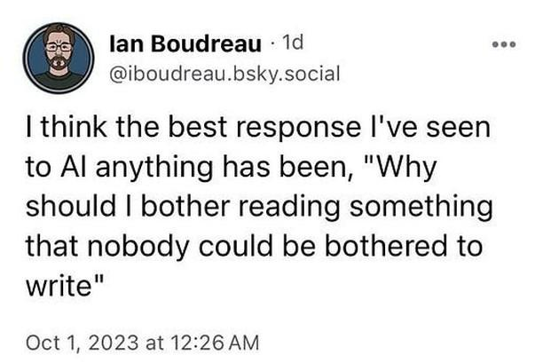
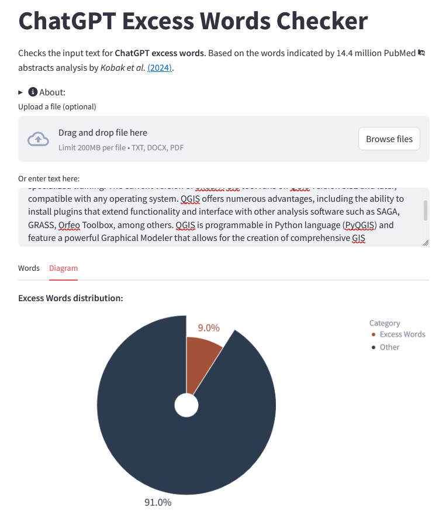

# ChatGPT Excess Words Checker

The use of Large Language Models (LLMs) in text generation has already deeply influenced our [lives](https://time.com/7026050/chatgpt-quit-teaching-ai-essay/) and, unfortunately, scientific literature. Recent findings by Kobak et al. ([2024](https://arxiv.org/abs/2406.07016v2)) suggested that approximately **10%** of all 2024 abstracts in the PubMed database were processed with LLMs, while Liang et al. ([2024](https://arxiv.org/abs/2403.07183)) found that up to **16.9%** of peer reviews of AI conference proceedings have been substantially modified by LLMs. Possibly, all this happens mostly with the help of ChatGPT, which occupies 76% of the global generative AI market (Van Rossum, [2024](https://www.flexos.work/learn/generative-ai-top-150)).

From our perspective, when the publishable text has undergone something beyond spell-checking or minor writing updates with the help of LLM, the question that should be asked by every researcher, scientist, teacher, or anyone who cares about this topic is as follows. "Why should I bother reading something that nobody could be bothered to write?"

### How does it work?
AI text detection is hard and not straightforward. Recent studies (e.g., Elkhatat et al., [2023](https://edintegrity.biomedcentral.com/articles/10.1007/s40979-023-00140-5)) and [Kaggle competitions](https://yorko.github.io/2022/detecting-generated-content/) show that without human manual review, it is currently nearly impossible to detect AI-generated text with confidence. While popular AI-detecting resources like GPTZero, zerogpt, and Copyleaks work like black-box models and offer blind reliance on their results, we suggest closely exploring the questionable bits of text.

One way to detect the potential overuse of LLMs for text paraphrasing and generation is through excess word usage. Kobak et al. ([2024](https://arxiv.org/abs/2406.07016v2)) analyzed 14 million PubMed abstracts from the 2010–2024 period and found that the frequency of certain words has statistically significantly increased over the decade. For example, "delves," "crucial," and "insights" were used more frequently in abstracts after the public release of ChatGPT 3.5 in November 2022. The authors suggested that the elevated frequency of these words is associated with LLMs.

Such a list of indicator words may serve as a red flag. However, we need to warn that it is not a silver bullet and, according to our analysis of Kobak's dataset, it is extremely domain-specific (in current version PubMed-specific). Therefore, it is highly possible that the tool may produce a false positive result, as Kobak et al. indicated that commonly used words in academic literature, such as "these," "research," "findings," etc., are included.

### Call to action
Since there is evidence that such lists of indicator words are domain- and LLM-specific, we invite you to get in touch and create a similar study for the Earth Science domain.

### Acknowledgments
I would like to thank [@yorko](https://github.com/yorko) for the fruitful discussion and relevant links on previous research. Additional kudos to [@FareedKhan-dev](https://github.com/FareedKhan-dev) for publishing his [app](https://github.com/FareedKhan-dev/Detect-AI-text-Easily) as open source; it provided the momentum for creating this one.